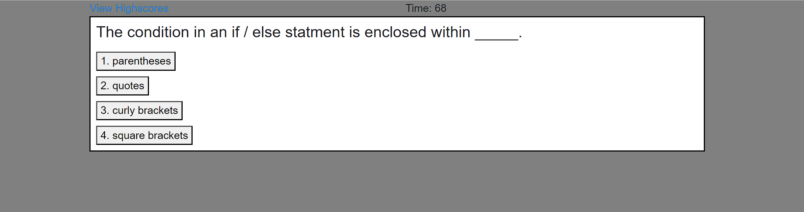

# Code-Quiz
Module 4 Challenge:
User Story;
As A coding boot camp student
I WANT to take a timed quiz on JavaScript fundamentals that stores high scores
SO THAT I can gauge my progress compared to my peers
Acceptance Criteria
GIVEN I am taking a code quiz
WHEN I click the start button
THEN a timer starts and I am presented with a question
WHEN I answer a question
THEN I am presented with another question
WHEN I answer a question incorrectly
THEN time is subtracted from the clock
WHEN all questions are answered or the timer reaches 0
THEN the game is over
WHEN the game is over
THEN I can save my initials and score.

Here is a screenshot of my deployed application:

All work is my own with the help of tutors, classmates, google and You Tube.

Source code is on Github, here is the URL of the repository: https://github.com/jason82autotech/Code-Quiz.git

The functional, deployed application can be viewed here: https://jason82autotech.github.io/Code-Quiz/